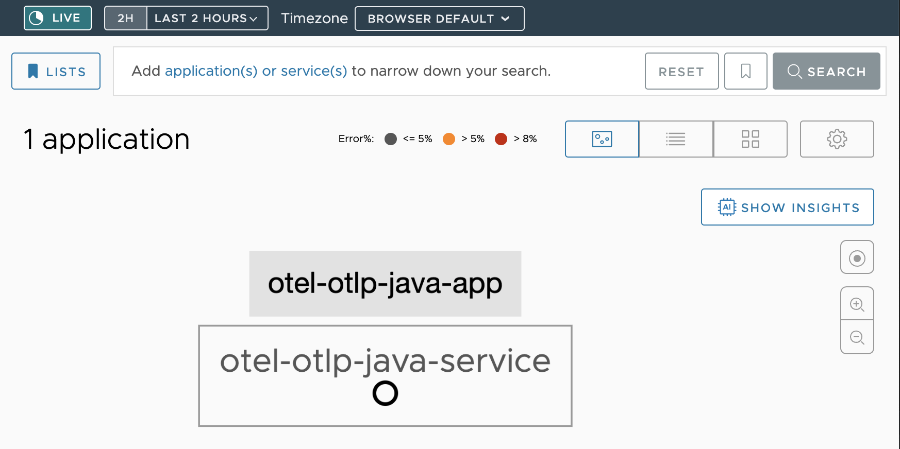
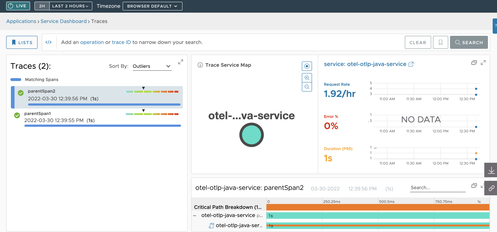

# Instrumenting Java Apps with OpenTelemetry

This guide shows you how to manually instrument your Java application using the OpenTelemetry API and the OpenTelemetry SDK. You learn how to send data to Tanzu Observability by Wavefront using the OpenTelemetry Collector and the Wavefront Proxy. 

**Tip**: To learn about the data flow from your application to Tanzu Observability by Wavefront, see [Send Trace Data Using the OpenTelemetry Collector](https://docs.wavefront.com/http://localhost:4000/opentelemetry_tracing.html#send-data-using-the-opentelemetry-collector-and-the-wavefront-proxy).

## Prerequisites

* Access to a Tanzu Observability by Wavefront account. This gives you access to a Wavefront instance. 
    If you don’t have one, [sign up for a free trial](https://tanzu.vmware.com/observability-trial).
* Clone the [OpenTelemetry Examples](https://github.com/wavefrontHQ/opentelemetry-examples) repository.
* Install the Docker platform. You’ll run the Wavefront proxy on Docker for this tutorial.
* Install the Wavefront proxy on Docker.
    ```
    docker run -d \
        -e WAVEFRONT_URL=https://{INSTANCE_NAME}.wavefront.com/api/ \
        -e WAVEFRONT_TOKEN={TOKEN} \
        -e JAVA_HEAP_USAGE=512m \
        -e WAVEFRONT_PROXY_ARGS="--customTracingListenerPorts 30001" \
        -p 2878:2878 \
        -p 30001:30001 \
        wavefronthq/proxy:latest
    ```
    Replace:
    * `{INSTANCE_NAME}` with the Tanzu Observability instance (for example, https://example.wavefront.com).
    * `{TOKEN}` with a Tanzu Observability API token linked to an account with Proxy permission.
      See [Generating an API Token](https://docs.wavefront.com/wavefront_api.html#generating-an-api-token).
    
    See [Install a Proxy](http://docs.wavefront.com/proxies_installing.html#install-a-proxy) to find other options for installing the proxy on your environment.
    
## Set Up an OpenTelemetry Collector for Tanzu Observability:

1. Download the `otelcol-contrib` binary from the latest release of the [OpenTelemetry Collector project](https://github.com/open-telemetry/opentelemetry-collector-releases/releases).
1. In the same directory, create a file named `otel_collector_config.yaml`.
1. Copy the configurations in the [preconfigured YAML file](https://github.com/wavefrontHQ/opentelemetry-examples/blob/master/otel_collector_config.yaml) to the file you just created. For details on OpenTelemetry configurations, see [OpenTelemetry Collector Configuration](https://opentelemetry.io/docs/collector/configuration/).
1. On your console, navigate to the directory you downloaded in the step above and run the following command to start OpenTelemetry Collector:
    ```
    ./otelcol-contrib --config otel_collector_config.yaml
    ```
      
## Send Data to Tanzu Observability

1. Open the `pom.xml` file in the `java-example` directory using your IDE.
1. Right-click and select **Add as a Maven Project**.

    The [```pom.xml```](https://github.com/wavefrontHQ/opentelemetry-examples/blob/master/java-example/pom.xml)
  file is configured with the required dependencies.

2. Run the application either from the IDE or using the terminal: 
    ```
      mvn compile exec:java -Dexec.mainClass="com.vmware.App" -Dexec.cleanupDaemonThreads=false 
    ```

    The ```main``` method in this Java application triggers the application to generate and emit a transaction trace, which includes a parent span and a few child spans.

You can examine the data sent by the application to Tanzu Observability on the [Tanzu Observability user interface](https://docs.wavefront.com/tracing_ui_overview.html).

Example: Application Status


Example: Traces Browser


## OpenTelemetry Instrumentation Steps

### Add an OpenTelemetry Interface

In your application, you need to configure an instance of the `OpenTelemetrySdk` as early as possible in your application. You can use the `OpenTelemetrySdk.builder()` method, as in this example:

```java
    static OpenTelemetry initOpenTelemetry() {
      OtlpGrpcSpanExporter spanExporter = getOtlpGrpcSpanExporter();
      BatchSpanProcessor spanProcessor = getBatchSpanProcessor(spanExporter);
      Resource serviceNameResource = Resource
              .create(Attributes.of(ResourceAttributes.SERVICE_NAME, SERVICE_NAME));
      SdkTracerProvider tracerProvider = getSdkTracerProvider(spanProcessor, serviceNameResource);
      OpenTelemetrySdk openTelemetrySdk = getOpenTelemetrySdk(tracerProvider);
      Runtime.getRuntime().addShutdownHook(new Thread(tracerProvider::shutdown));

      return openTelemetrySdk;
    }

    private static OpenTelemetrySdk getOpenTelemetrySdk(SdkTracerProvider tracerProvider) {
      OpenTelemetrySdk openTelemetrySdk = OpenTelemetrySdk.builder().setTracerProvider(tracerProvider)
        .buildAndRegisterGlobal();
      return openTelemetrySdk;
    }

    private static SdkTracerProvider getSdkTracerProvider(BatchSpanProcessor spanProcessor, Resource serviceNameResource) {
      SdkTracerProvider tracerProvider = SdkTracerProvider.builder().addSpanProcessor(spanProcessor)
        .setResource(Resource.getDefault().merge(serviceNameResource)).build();
      return tracerProvider;
    }

    private static BatchSpanProcessor getBatchSpanProcessor(OtlpGrpcSpanExporter spanExporter) {
      BatchSpanProcessor spanProcessor = BatchSpanProcessor.builder(spanExporter)
        .setScheduleDelay(100, TimeUnit.MILLISECONDS).build();
      return spanProcessor;
    }

    private static OtlpGrpcSpanExporter getOtlpGrpcSpanExporter() {
      OtlpGrpcSpanExporter spanExporter = OtlpGrpcSpanExporter.builder()
        .setEndpoint(OTEL_COLLECTOR_ENDPOINT)
        .setTimeout(2, TimeUnit.SECONDS)
        .build();
      return spanExporter;
    }
```
If you are writing a library instrumentation, enable users to inject an instance of `OpenTelemetry` into the instrumentation code. If this is not possible, you can use an instance from the `GlobalOpenTelemetry` class. 
  
**Note**: You can’t force end users to configure the global OpenTelemetry class.

### Get a Tracer
The `Tracer` is responsible for creating spans and interacting with the `Context`. A `Tracer` needs to be acquired using the OpenTelemetry API. Specify the name and version of the library that is instrumenting your library or application.

```java
  private static Tracer getTracer() {
      tracer = openTelemetry.getTracer(<my_instrumentation_library_name>, <my_instrumentation_library_version>);         
      return tracer;
  }
```
**Note**: the ```my_instrumentation_library_name``` and ```my_instrumentation_library_version``` of the `Tracer` are purely informational. All `Tracers` created by a single OpenTelemetry instance will work together, regardless of the name or version.

### Create a Nested Span, Add an Attribute

To create a span, you only need to specify the name of the span. The start and end time of the span are set automatically by the OpenTelemetry SDK. Most of the time, you need to correlate spans for nested operations

In OpenTelemetry, you can create spans freely, and it’s up to the implementor to annotate them with attributes specific to the operation. `Attributes` provide additional context on a span and about the specific operation it tracks, such as results or properties of an operation.

You can link spans manually for the `main` method to call the `child` method as follows:
  
```java
  public static void main(String[] args) throws InterruptedException {

    /*this will make sure that a proper service.name attribute is set on all the
      spans/metrics.*/
    System.setProperty(OTEL_RESOURCE_ATTRIBUTES_KEY, OTEL_RESOURCE_ATTRIBUTES_VALUE);

    /*tracer must be acquired, which is responsible for creating spans and interacting with the Context*/
    tracer = getTracer();

    /*an automated way to propagate the parent span on the current thread*/
    for (int index = 0; index < 3; index++) {
        /*create a span by specifying the name of the span. The start and end time of the span is automatically set by the OpenTelemetry SDK*/
        Span parentSpan = tracer.spanBuilder("parentSpan").setNoParent().startSpan();
        logger.info("In parent method. TraceID : {}", parentSpan.getSpanContext().getTraceIdAsHexString());

        /*put the span into the current Context*/
        try (Scope scope = parentSpan.makeCurrent()) {

            /*annotate the span with attributes specific to the represented operation, to provide additional context*/
            parentSpan.setAttribute("parentIndex", index);
            childMethod(parentSpan);
        } catch (Throwable throwable) {
            parentSpan.setStatus(StatusCode.ERROR, "Something wrong with the parent span");
        } finally {
            /*closing the scope does not end the span, this has to be done manually*/
            parentSpan.end();
        }
    }

    /*sleep for a bit to let everything settle*/
    Thread.sleep(2000);
}

private static void childMethod(Span parentSpan) {

    tracer = getTracer();

    /*setParent(...) is not required, `Span.current()` is automatically added as the parent*/
    Span childSpan = tracer.spanBuilder("childSpan").setParent(Context.current().with(parentSpan))
            .startSpan();
    logger.info("In child method. TraceID : {}", childSpan.getSpanContext().getTraceIdAsHexString());

    /*put the span into the current Context*/
    try (Scope scope = childSpan.makeCurrent()) {
        Thread.sleep(1000);
    } catch (Throwable throwable) {
        childSpan.setStatus(StatusCode.ERROR, "Something wrong with the child span");
    } finally {
        childSpan.end();
    }
}
```

## Next Steps

This tutorial covers a simple example. Refer to [the OpenTelemetry guide](https://opentelemetry.io/docs/instrumentation/java/manual_instrumentation/) for details, such as `events`, `links`, `context propagation`, and more.
